# Shreyas's GitHub Profile

<h3><code>shreyas@github ~ $ ./contributions.sh</code></h3>

  

<h3><code>shreyas@github ~ $ whoami</code></h3>

<table>
  <tr>
    <td valign="top">
      
    </td>
    <td valign="top">
      
    </td>
  </tr>
</table>

 

## 🚀 Animated GitHub Profile

This repo automatically displays:
- **Contribution Heatmap** – Updated daily (GitHub Actions)
- **ASCII Portrait** – Your photo as ASCII art with typing animation
- **Info Card** – Neofetch-style system info

All SVGs animate on page load! 🎨

## 📋 Setup

1. Add your photo: `cp your-photo.jpg source-photo.jpg`
2. Run: `python -m venv .venv && source .venv/bin/activate && pip install -r scripts/requirements.txt`
3. Generate: `cd scripts && python prep_photo.py && python make_ascii_svg.py && python make_info_card.py`
4. Commit & push

GitHub Actions will update the heatmap daily at 06:17 UTC.

